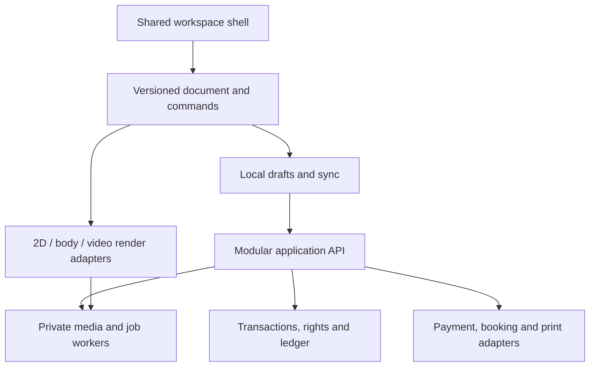

# ARTOO — Modern product and experience specification

Version 2.1 proposal · 22 September 2026 · Prepared for Morgan H. Sherer

**Product definition:** ARTOO is a full creative workspace for designing tattoos, editing them directly on a body, comparing realistic placement options, collaborating with artists, and carrying an agreed design into temporary try-on, licensing, booking, payment, and an artist-ready handoff.

**The core promise:** Make the design, make it fit, understand the options, and carry the same work forward without rebuilding it in another screen.

**Latest user clarification:** Canva is the UX/UI quality floor, not the required codebase or supplier. Evaluate other capable products, SDKs and open-source editors as possible bases; every ARTOO feature must meet that quality bar regardless of its implementation source. The companion `ARTOO_Current_Technology_and_Base_Options.md` reviews nine distinct base candidates and recent mapping, segmentation, layered editing and browser advances.

This is a substantial replacement design specification, with a complete companion capability catalogue and source-to-contract register. It is not a claim that the software has been implemented or tested. “Must” below specifies the proposed product contract. New interaction details, architecture choices, sequencing, numerical quality budgets, and commercial changes remain recommendations unless identified as direct source decisions. The seven original files remain evidence; this package does not erase their history.

## 1. Authority, recovered decisions, and boundaries

### Source key

| Key | Supplied source | Use and limits |
|---|---|---|
| S1 | `artoo-product-requirements-doc.md` | Broadest compact PRD: 255 bullet occurrences including business/research instructions. Its technology list and numeric commercial assumptions are historical proposals, not runtime evidence. |
| S2 | `# ARTOO Product Requirements Docume.txt` | Earlier compact PRD: 204 bullet occurrences. Preserve its complete feature population even where repeated in S1. |
| S3 | `arttoo7.txt` | Conversation and pasted implementation history. Direct Morgan corrections establish editor identity, shared tools, live editing on skin, visual language, and regression problems. Pasted assistant answers under a Morgan delimiter are not automatically new user decisions. |
| S4 | `ARTOO is an innovative tattoo platf.txt` | Requirements, research, and code history. Contains texture-space approach and explicit parametric → photogrammetry → MetaHuman correction. |
| S5 | `artoo research.pdf` | 120-page historical research conversation. Useful for intended capabilities and questions; competitor internals, dataset rights/counts, performance claims, and rankings require fresh verification. |
| S6 | `PLEASE REFORMAT ANSWERS___ARTOO…pdf` | One-page answer sheet. Some questions and one long pricing answer are visibly clipped in the original PDF. Do not reconstruct missing text as fact. |
| S7 | `# ARTOO Architecture Proposal.txt` | Proposal dated 13 March 2025, including microservices, polyglot backend, multiple databases, Kubernetes, and large cost estimates. No repository supplied to establish that this architecture exists. |

Line references use the supplied text files as read with `splitlines()`. PDF references use printed extraction page numbers. The register preserves individual PRD source occurrences; the catalogue adds direct-history corrections and modern explicit contracts. Full historical code correctness and every assistant research assertion were not audited.

### Decision reconciliation

| Decision | Evidence | Status in this proposal |
|---|---|---|
| Creation and tattoo visualization are the center; AI generation is a side feature | S3 lines 74–84, 976–980, 13561–13563 | **CONFIRMED** direct correction. Supersedes generator-first navigation and any interpretation that generation owns the product. |
| Studio, AI, avatar, AR, configurator and cover-up use one coherent shell | S3 lines 92–110 | **CONFIRMED**. Context changes tools and panels; the project is continuous. |
| All editor tools remain available in Digital Try-on; edit while on skin | S3 lines 18761–18833, 19097–19099 | **CONFIRMED**. A return-to-editor-only workflow contradicts this instruction. |
| Call the surface “Digital Try-on” | S3 lines 18761–18763 | **CONFIRMED**. It contains multiple modes, not only still images. |
| Default artboard is white in light and dark UI | S3 lines 3925–3927, 16216–16218 | **CONFIRMED**. Display background and exported alpha are separate properties. |
| Tools have discoverable submenus; shapes belong under Elements | S3 lines 6312–6314 | **CONFIRMED**. Do not flatten every option into the primary rail. |
| Modular components and tools; avoid an enormous route component | S3 lines 6391–6393 | **CONFIRMED** implementation constraint. |
| Reuse a working background remover before adding a vendor | S3 lines 1008–1010 | **CONFIRMED** principle; whether any current implementation works is **NOT RETRIEVED**. |
| NeRF-first replaced by texture-space placement and progressive avatars | S4 lines 8247–8327, 9007–9047 | **CONFIRMED** pivot; NeRF-first is **SUPERSEDED**. MetaHuman remains an advanced integration to prove, not guaranteed anatomical accuracy. |
| Brand: black/white, red/purple, tiny yellow accents | S3 line 3 | **CONFIRMED** direction. Proposed tokens below operationalize it. |
| One account, up to three profiles, one per type | S6 page 1; S1 line 75 | **CONFIRMED** rule. Organization seats do not require duplicate login identities. |
| Mature-content preference, inclusive of alternative lifestyles | S3 lines 11752–11754 | **CONFIRMED** preference; implement clear audience controls and disclose unavoidable platform/provider constraints. |
| Specific prices, 8 vs 2 daily credits, no-save vs watermarked free exports, tier names | S6 page 1; S1 lines 170–187; S4 lines 839–851; S3 line 214 | **UNRESOLVED** across records. Preserve alternatives; do not silently choose a price or remove a tier. |
| E2EE | S6 unanswered; S1 line 150; S3 local-message preference | Retained target; threat model, recovery and processing boundaries **UNRESOLVED**. |
| $60 budget; high growth forecasts; enterprise cost estimate | S1 lines 353–368, 458–461; S7 costs | **HISTORICAL**. Current budget and team capacity **UNKNOWN**. The old projections are not forecasts we can rely on. |

**Authority rule:** direct corrections control their stated scope. Cross-file chronology is not established just by upload order or filename. Source inclusion preserves a capability; it does not turn a prior assistant suggestion into a confirmed business decision. Current user authorization covers this redesign and grounded recommendations, not deleting a live system or activating financial products.

## 2. Focus recommendation and what “10×” means

The highest-confidence product recommendation is a **shared design-and-placement workspace**. This follows the direct corrections and recurrent failure reports in S3, rather than a guessed market segment. The commercial starting hypothesis is an **artist–client consultation and handoff workflow**: repeatable professional use could generate willingness to pay while clients can participate with little setup. That commercial hypothesis is **INFERRED**, not customer-validated.

| Recommendation | Grounding | Expected benefit | Evidence needed to keep it |
|---|---|---|---|
| Complete the editor and body-placement loop first | Repeated user reports of missing canvas/tools, broken fill, weak placement and incomplete alpha removal | Users can finish actual work, not encounter disconnected feature demos | Observed completion of the workflows in §12, saved/reopened artifacts, artist assessment |
| Make the full toolset searchable; use context to reduce visible clutter | Shared-tool requirement plus absent submenus in S3 | Broad capability with a manageable immediate interface | Novices find tools without prompting; experts complete precision tasks efficiently |
| Prioritize parametric/UV placement plus calibrated photo previews | Confirmed NeRF pivot in S4 | Immediate use without a full scan; path to wrap-around layouts | Seam tests, physical-scale checks, diverse-body evaluation |
| Ship one supported commerce route end to end before many payment rails | Split-payment and multi-party obligations; external provider constraints [E4, E5] | Lower reconciliation and support burden | Sandbox refunds, disputes, payouts and fee reconciliation; provider eligibility |
| Keep long-tail community, hardware, predictive health and speculative ownership features visible in the roadmap | They are explicit source requirements, but often depend on unproven systems or external partners | Preserves vision without blocking the core experience | Named feasibility/evidence gates in the catalogue |
| Replace infrastructure-first planning with measured complexity | S1 bootstrapping requirement conflicts with S7 scale assumptions | Fewer moving parts and lower operating burden | Actual latency, concurrency, reliability and cost measurements |

“10×” is an ambition for completeness and clarity, **not a measured performance claim**. Here it means ten concrete improvements: one project model; full shared tools; reversible editing; measurable body fit; comparable scenarios; exact physical output; rights attached to assets; collaboration attached to revisions; traceable commerce; and release gates that prove the visible product works.

**No feature is deleted by a phase label.** F = foundation contract; C = connected commerce/collaboration; X = expanded capability; R = research or partner-gated capability. These are recommended order and dependencies, not user-approved scope cuts or dates. Foundation work can contain bounded research spikes, particularly around real body wrapping.

## 3. Canva-level versatility, stated precisely

Canva is a useful benchmark for a connected creative suite, reusable assets, consistent editing, collaboration, and output workflows. Its official 2025 announcement includes video, forms, data-connected designs, email, brand workflows and editable AI outputs [E1]. Its 2026 announcement adds offline essential editing and connected print/professional workflows [E2]. This benchmark review is representative, not an exhaustive inventory or verified tool-count parity audit.

**ARTOO must deliver breadth through a capability contract, not a claim of “as many buttons.”** Every supported tool needs a discoverable entry point, meaningful settings, a valid target, visible result, undo/redo, save/reopen fidelity, input alternatives, failure recovery, entitlement behavior and acceptance evidence. Tool counts alone do not establish parity.

| Capability family | Required ARTOO interpretation | Scope disposition |
|---|---|---|
| Templates and assets | Tattoo templates, body-region compositions, flash sheets, mood boards, presentations, portfolios and promotional layouts; searchable licensed assets | Explicit target |
| Raster editing | Crop, masks, selection, erasure, corrections, effects, segment editing, background removal and reversible retouching | Explicit target |
| Vector and layout | Shapes, paths, nodes, grouping, guides, rulers, alignment, distribution, physical sizing, multi-artboard composition | Explicit target |
| Drawing | Distinct brush engines/presets, stylus pressure, symmetry, line/curve tools, fill and erasure | Explicit target; some engines need proof |
| Typography | Font discovery, rich text, path text, spacing, language support, outlines and export checks | Explicit target |
| Video, motion and sound | Recorded try-ons, keyframes, comparison clips, timelapse, captions, narration/music and presentation playback | X extension, basic recording earlier |
| Whiteboards/docs/presentations | Shared reference board, client brief, annotated consultation deck and educational content | Connected views of the same project |
| Brand/workspace system | Studio assets, palettes, templates, permissions, approval rules and reusable defaults | C/X target |
| Forms and data | Briefs, consent workflows, client tables, calendars, stock/cost estimates and studio metrics | Domain-focused target; general spreadsheet suite remains a separate expansion decision |
| Websites/email/social | Artist pages, portfolio publishing, promotional exports, consented campaign drafts and social connectors | C/X target; full arbitrary website builder is an expansion proposal |
| Apps/automation/code | Scoped extensions, saved actions, validated scripts, external booking/CRM/fulfillment adapters | X; no unrestricted code execution inside a project |
| AI assistance | Generate, refine, select, remove, search, summarize and propose reversible edits within the workspace | Helper, never mandatory entry point |
| Print and fulfillment | Exact-size stencil/export and temporary tattoo ordering tied to a specific design revision | Core handoff plus C fulfillment |
| Reliable work | Autosave, restore, offline editing, versions, comments and transparent permissions | Core quality contract |

**Literal parity with every current Canva product is still unbounded.** All named families above remain represented; unrelated general-purpose suite features are not silently promised for launch. A later parity audit should enumerate the agreed competitor surface feature by feature, version and platform, with demonstrated ARTOO equivalents. The detailed catalogue goes beyond the old “Canva/GIMP basics” phrasing without asserting completed parity.

## 4. Experience architecture and navigation

### 4.1 Home and global navigation

Home opens a project dashboard: Create; Resume recent work; Shared with me; personal collections; artist/client requests; and role-specific upcoming work. Generator content does not dominate it. An empty dashboard offers “Start blank”, “Use a template”, “Upload a design”, “Try on my body”, and “Start a client brief”. Each creates or opens the same Project object.

Global navigation groups **Create**, **Projects**, **Discover**, **Work**, and **Account**. Create opens the workspace; Discover contains designs/artists/maps/education; Work contains commissions, booking, orders, payments and studio management. The account/profile switcher always shows which user, artist or studio context is active. A collapse control stays near the ARTOO mark. Route changes do not discard unsaved work.

### 4.2 Persistent workspace shell

| Area | Contents | Interaction contract |
|---|---|---|
| Top bar | Project name, breadcrumb, explicit save state, undo/redo, workspace mode, collaborator state, Share, Export/Go-time | Remains visible in all creation modes. No fake “Saved” before persistence acknowledgment. |
| Left tool rail | Select, Templates, Elements, Text, Uploads, Draw, Erase/Select Region, Layers, AI, Test, More | Stable categories with labels/tooltips and keyboard access. Submenus contain variants such as rectangles and ellipses. |
| Tool drawer | Active category’s search, presets, assets and settings | Resizable/collapsible. Keeps per-tool settings when switching. Does not delete tools because another panel opens. |
| Main stage | Design artboard, photo/body canvas, avatar, live camera or video | Default design artboard white. Zoom/pan distinct from artwork scale. No placeholder label replacing the canvas. |
| Right inspector | Selection properties, transforms, fill/stroke, appearance, mask, placement and fit, measurements, permissions | Shows actual selected-object values, mixed-selection state and units; changes affect only the intended targets. |
| Bottom strip | Artboards or clips, scenario variants, comparison tray, timeline, zoom and contextual status | Only relevant strip is expanded; persistent access remains. |
| Command search | Search all available actions, assets and shortcuts | Results state unavailable reasons, required selection or plan. No feature disappears solely because it is outside the surfaced subset. |

Suggested desktop geometry for the first visual design pass: 56 px top bar, 72 px tool rail, 280–340 px tool drawer, 280–360 px inspector, flexible central stage. Below roughly 1,100 px, drawers become mutually exclusive overlays; on narrow mobile they become bottom sheets with large controls. These are design hypotheses to verify, not fixed pixel mandates.

The UI has **Guided**, **Standard**, and **Advanced** workspace presets. They change visible density and help, not document capability, file format or permissions. Users can reveal any entitled tool. Shared learning across modes is more important than inventing separate mini-app layouts.

### 4.3 Visual language and accessibility

Use the confirmed black/white foundation with red primary actions, purple selection/assistance accents and sparing yellow attention markers. Do not use red simultaneously for ordinary selection and destructive confirmation. Proposed tokens: canvas white `#FFFFFF`; dark workspace `#141318`; elevated panel `#211F27`; light workspace `#F4F3F6`; dark text `#18151E`; primary red `#B91C3B`; purple `#6D28D9`; warning yellow `#F2C94C` with dark text. Final pairings require measured contrast checks. Use Inter or a comparable readable sans serif; adjustable UI density and text size; visible keyboard focus; persistent labels for obscure icons.

Target WCAG 2.2 AA for the interface [E6]. Provide keyboard/numeric alternatives to dragging, semantic layers/object lists for canvas content, non-color state indicators, reduced motion, 200% text zoom, accessible modals, captions/transcripts and reflow. Use a product target of 44×44 CSS-pixel touch targets where practical; distinguish that target from the standard’s exact minimum and exceptions. A freeform drawing surface has intrinsic constraints, but the property controls, object tree, templates, transformations and export flows must remain operable without precision pointer input.

Voice is optional. Recognizable tool choices, examples and editable brief templates reduce reliance on word recall. Requests such as “make this narrower” show the proposed target and reversible change before applying ambiguous actions.

## 5. Document model: the foundation of versatile editing

The editable source is a versioned document, not a flattened preview image. A project can contain several artboards, placement variants, body targets, references and exports. Rendering libraries are adapters; their private serialization is not the permanent interchange contract.

| Object | Minimum recorded fields and invariants |
|---|---|
| Project | ID, owner/account and acting profile, collaborators, purpose, document schema version, revision head, folders/tags, timestamps |
| Artboard | ID, physical width/height when known, display units, raster resolution, output profile, presentation background, print background, object ordering |
| Design object | Stable ID, type, transform, bounds, source asset/version, text/path/stroke content, fill/stroke/effects, masks, visibility/lock, attribution/license reference |
| Source asset | Immutable original, MIME/decoded dimensions, color profile, alpha metadata, checksum, owner/license, import provenance, derived previews; never replace original with compressed preview |
| Body target | Photo/video/parametric/scan type, subject permission, coordinate frame, model version, calibration and uncertainty, region/side, pose, visibility/occlusion masks |
| Placement | Design revision, body target/version, region and side, UV/mesh anchor or photo transform, rotation/scale/mirroring, physical dimensions if calibrated, deformation, fit quality and unresolved regions |
| Scenario | Base placement revision, controlled changes (light, ink, pose, age illustration), environment parameters, illustrative/calibrated status, comparison notes |
| Review | Author/role, exact revision/object/frame/region, annotation, response and resolution; approvals cannot float to newer revisions |
| Commerce record | Offer and license versions, quote, parties, currency, allocation schedule, order/booking references, provider events and ledger entries |
| Export | Exact source revision, included assets, rights summary, dimensions/calibration, warning/preflight results, artifact checksums and recipient permission |

**Coordinate rules:** distinguish screen pixels, design units, physical millimeters, normalized UV coordinates and 3D world coordinates. Each transform names source and target frames and records handedness, units and mirror state. A universal body map is a versioned convention, not an assertion that all meshes share UVs. New scans/avatars require retargeting; report distortion and seam failures instead of silently shifting placement. Calibrating a photo needs a known reference or validated depth source; camera pixels alone do not establish real tattoo size.

**History rules:** one drag, stroke or slider gesture is one undo transaction; preview updates do not flood history. Undo affects the user’s edits, not payment history or another collaborator’s unrelated action. Changing body mode preserves source design, placement variants, selection when meaningful, and revision lineage. Background processes commit a result only to the expected source revision; stale results become alternatives.

**Persistence rules:** autosave local drafts promptly, then show separate cloud acknowledgment. A quota, permission, network or storage failure offers recovery/export. Offline edits form a branch if reconnection conflicts; never silently overwrite. Mark which assets/models are actually available offline. Uploading private body media to a remote provider requires an explicit processing choice.

## 6. Full editor behavior

The companion catalogue specifies every source capability. The following contract applies to every editing action.

1. **Discover:** the control exists in the correct category, has a label, and is searchable.
2. **Configure:** the user sees defaults, presets, units and valid ranges before committing.
3. **Target:** selection and edit scope are explicit—source artwork, mask, body target, placement, or scenario.
4. **Preview:** changes update the intended view and any linked body projection; heavy work shows progress and cancel.
5. **Commit:** one reversible command records meaningful parameters and the previous state.
6. **Persist:** save/reopen and export retain the operation, or disclose a supported flattening conversion.
7. **Recover:** errors keep prior work and explain the next available action.
8. **Prove:** release evidence includes behavior, round-trip fidelity and keyboard/touch paths, not a screenshot of the button.

### Required depth by tool family

| Family | Explicit scope |
|---|---|
| Select/transform | Click, marquee, multi-select, lasso where applicable; move/resize/rotate/flip/skew; lock proportions; pivot; numeric position and dimensions; snapping; alignment/distribution; nested group selection; visible handles |
| Draw | Pen, pencil, airbrush/spray, ink, tattoo-tip simulation, watercolor and crayon; size, opacity, flow, hardness, spacing, smoothing, pressure/tilt when available; presets and swatch preview; distinguish actual brush behavior from labels |
| Lines/paths | Freehand, straight/polyline, Bézier curves, node insertion/deletion, handles, closed/open path, join/cap, stroke width, dash, path simplification with preview; symmetry/mirroring |
| Fill/color | Fill versus stroke; RGB/hex, alpha, eyedropper, recent/saved palettes, gradient stops, patterns; vector fills and bitmap flood fill with tolerance/contiguous/selection boundaries; visible fallback when sampling is blocked |
| Erase/selection | Object delete, freehand raster erase, reversible mask erase, background removal, click/box/brush-assisted segmentation, add/subtract/invert/feather selection, edge cleanup; preserve white design ink |
| Text | On-canvas edit, fonts, size, weight/style, decoration, kerning/tracking, line height, alignment, curved/path text, fill/stroke/shadow; right-to-left/non-Latin scripts; missing-font warning and optional outline conversion |
| Elements | Primitive/custom shapes, frames, vector assets, transparent PNGs, licensed imagery, uploads; replace source while preserving intended transform; node editing for genuine vectors |
| Layers | Stable names, thumbnails, drag ordering, visibility, lock, grouping, clipping/masks, blend/opacity, duplication, isolation and safe merge; decorative grid is not an exportable object |
| Images/effects | Crop/straighten, exposure/brightness/contrast/saturation/temperature, blur/sharpen, grayscale/sepia, reversible effect stack, clone/heal proposal with source preview, upscale with fidelity warning |
| Layout/output | Custom dimensions, presets, rulers/guides/grid, snap options, margins/bleed, artboards, resize with anchor behavior, output profiles, transparent export and print preview |
| Collaboration | Shared sketchbook and references, comments on objects/body regions, roles, version comparison, permission-aware coediting and explicit approval |

### Editing on a body is a first-class operation

In Digital Try-on and Avatar Studio, choose **Edit design** or **Adjust placement**. This distinction prevents a brush stroke from accidentally repainting the body photo. While editing the design, pointer events map through the current placement into source artwork coordinates and a live preview updates on skin. If the inverse mapping is ambiguous at an occluded or folded region, ask the user to change view or reveal the UV map; do not paint the wrong surface. A synchronized flat-design inset is available, but leaving the body view is never the only editing route.

All shared tools remain accessible. Background removal edits the selected design mask; skin correction edits the body mask; erasing an existing tattoo in a cover-up study creates a labeled retouched scenario, never rewrites the original reference. Text is not silently mirrored when the camera preview is mirrored. Deleting an overlay deletes the placement instance unless the user explicitly chooses to delete its source.

## 7. Visualization modes and honest realism

| Mode | Inputs, controls and result | Boundary and acceptance |
|---|---|---|
| Static photo | Body photo, eligible design, target region, optional size calibration; automatic mask/fit plus correction brush, rotation, flip, scale, bend and anchors | Supports bounded visible-surface fit. A single photo cannot establish unseen anatomy. Reopen preserves mask and calibration. |
| Live AR | Camera consent, selected body/region, reusable design and tracking confidence; lock/unlock, capture, flip camera, pause/edit | Needs temporal tracking and occlusion. Loss of confidence visibly freezes/hides placement and guides reacquisition; no floating artwork presented as stable. |
| Recorded video | Import or record clip; choose range, track region, edit keyframes, inspect failed frames, export comparison | Do not assume live preview tracking remains valid across cuts/occlusion. Timestamped corrections remain editable. |
| Parametric avatar | Adjustable proportions/body regions, skin display palette, neutral/posed views, UV placement | Immediate generic planning. Do not call a weight/height slider a personal scan. Cover limb, torso and seam-spanning layouts. |
| Photogrammetric target | Guided multi-angle capture of a region, quality checks, reconstruction job, consent, review and retarget | Only publish validated reconstructed surfaces. Failed scans preserve the prior avatar and explain recapture needs. |
| MetaHuman integration | Licensed compatible model pipeline, tested retargeting, performance budgets and exports | Advanced conditional integration; cinematic appearance does not establish accurate personal anatomy or ink behavior. |
| UV/body map | Region/side map, seam markers, physical scale when available, linked 3D view | Mapping is model/version-specific. Round-trip landmarks and sleeve seams must pass tests. |
| Multi-angle comparison | Linked views/poses of the same placement revision | Independent photos require registration; show unmatched views. Never silently use separate unrelated placements. |
| Studio mirror/projection | Calibrated device/display or projector plus placement, client and practitioner controls | Partner/hardware gate; not a precision stencil replacement without calibration proof. |

### Rendering pipeline proposal

Decode and orient source → inspect artwork alpha → choose/correct body region mask → estimate visible geometry/depth/landmarks → establish placement in named coordinates → warp/project artwork → apply visibility/occlusion → blend and relight → render with quality state → capture the same revision and parameters.

These are distinct capabilities. A pose skeleton is not a dense skin mesh; a person mask may include clothing; semantic selection does not supply UV coordinates; perspective homography alone cannot wrap a sleeve around a curved limb. MediaPipe’s documented pose task supplies landmarks and optional segmentation, so it is a candidate input rather than a complete tattoo-fit system [E3]. The proposed pipeline must be evaluated as a whole. The updated technical shortlist includes SAM 3/3.1 for selection/tracking, SAM 3D Body for assisted parametric initialization, MoGe-2 and eligible Depth Anything 3 variants for geometry; see the current-technology review for evidence, limits and experiments.

**Quality ladder:** (1) manual flat placement, explicitly labeled; (2) assisted photo warp with corrected visible-skin mask; (3) calibrated parametric/scan-based surface projection; (4) validated temporal body tracking. Higher labels require passing their own gates. The product’s body-wrapping promise is not satisfied by stage 1.

“Automatic” means the system proposes fit and supports efficient correction. It does not mean every body, light condition and image succeeds without input. Low confidence yields a useful correction route; unknown physical size remains unknown.

### Test Studio: tests the user can run

The Test panel is part of the creative workspace. It is separate from developer quality assurance.

- **Fit:** front/side/back views, sleeve seam, motion/pose, occlusion, skin-edge spill and joint distortion. Surface a failed region with “Adjust fit”.
- **Scale:** millimeters/inches, calibration ruler, common-object comparison, exact-size paper proof and proposed alternate sizes.
- **Appearance:** light/time of day, environment, skin display conditions, ink palette/white/UV visualization, opacity and texture. Keep the original photo beside a simulation.
- **Longevity/healing:** clearly labeled illustrative scenarios with assumptions. Do not present an age slider as a validated personal forecast.
- **Design quality:** readable lettering at selected size, mirrored-script alert, clipping, low resolution, thin-line/gap advisory, palette comparison; artist checks remain reviewable judgments.
- **Rights/output:** permitted use, attribution, exact revision, unresolved fonts, alpha and print preflight.
- **Decision:** side-by-side/A–B slider, favorite, annotate, ask artist, save scenario, approve selected revision, send to handoff.

A scenario report states input revision, one or more changed variables, assumptions and outcome. “Test passed” refers to the particular check, not a guarantee that a real tattoo will heal or age a certain way.

## 8. End-to-end workflows

### A. Client explores and prepares a consultation

Open dashboard → upload/design/template → edit using complete tools → select photo or parametric body → confirm artwork transparency → place and adjust with physical units when calibrated → compare versions and scenarios → invite an artist to the selected revision → resolve annotations → approve a revision → export Go-time pack or request a quote. Optional AI helps anywhere. Body scanning, marketplace purchase, account upgrade and generation are not unconditional prerequisites to trying personal artwork.

### B. Artist makes a sleeve with a client

Open brief and references → choose model and body side → lay out motifs on UV map → connect across seams → inspect linked 3D views → draw/refine directly on the body projection → compare pose distortions → capture measurements and unresolved fit → co-review and freeze revision → create stencil/placement pack and quote → take supported deposit → book session. Revising the art after approval invalidates only dependent approvals/quotes under explicit policy; it does not erase payment history.

### C. Cover-up planning

Import existing tattoo photo as locked evidence → identify region and calibrate → layer new composition with original visible → compare coverage and contrast under stated assumptions → annotate artist concerns → revise while projected → obtain professional review → export both original reference and proposed plan. “Potential” is advisory; do not guarantee concealment or recommend treatment from a photo.

### D. Temporary tattoo try-on

Select approved design revision → validate merchandise/temporary-tattoo rights → choose supplier material and actual dimensions → inspect bleed/alpha/print scale and orientation → quote quantity, shipping, taxes and artist royalty → authorize payment → submit idempotent fulfillment order → track production and shipment → show reprint/refund path for defects → optionally compare physical trial with digital preview. Supplier material claims are verified catalogue data, not permanent promises copied from the old PRD.

### E. Commission and money

Brief → artist proposal → versioned offer/license/revision allowance → quote acceptance → provider-supported deposit/charge → draft review → requested revision or acceptance → final deliverable and balance → scheduled payout → receipt/statement. Cancellations, no-shows, disputes, refunds and failed payouts are explicit branches with visible responsibility and retained records.

## 9. Commerce, organizations and rights

### Payments are a domain, not a checkout button

Preserve all directions named in the sources: client→artist/studio, client→ARTOO, studio→artist, artist↔artist collaboration, user↔user requested transfers/gifts, and platform→recipient payouts/refunds. Each route needs a documented purpose, eligible jurisdictions/accounts, provider support, fee allocation, settlement, reversal and dispute behavior. General-purpose P2P/wallet functions remain a distinct requested capability requiring an eligible provider route; a marketplace payment API does not automatically implement it.

Recommended initial implementation uses provider-managed payment collection and connected-party payouts, with an internal append-only accounting ledger. Do not market delayed transfers as escrow. Stripe explicitly distinguishes manual payout control from escrow [E5]; its separate-charge model has refund/transfer and regional responsibilities that must be designed deliberately [E4]. Provider choice is not frozen here.

An illustrative $100 design transaction with $10 platform allocation, $20 studio allocation and $70 artist allocation balances to $100 before separately specified processing fees, taxes, refund effects and FX. Amounts use integer minor units with currency exponent metadata. Every allocation rule is versioned at acceptance; upgrading a membership does not retroactively change an accepted contract. Duplicate webhooks cannot duplicate credit or payout. Refunds must reverse or otherwise reconcile allocations; insufficient recipient funds become an explicit receivable/liability state.

Requested rails remain listed: card, PayPal, Venmo, Cash App, Google Pay, Revolut, Stripe-supported methods, Apple Pay and crypto. Availability is shown by device, region, currency and transaction type. Credits are usage units, cash balances are money, and gifts are entitlements: do not merge them into one ambiguous wallet.

### Organization and entitlement model

Account → up to three role profiles (user, artist, studio). Organization membership, branch, employment/contract relationship, role permission and paid plan are separate dimensions. Studio policy can constrain its own bookings/offerings and scoped staff actions, not override another person’s account privacy or legal rights. Display the effective policy and its source before an artist accepts affiliation.

Retain UT, AT and ST plan families and all historical alternatives. Exact labels, quotas, commission rates, refunds, free exports and early-adopter terms are unresolved configuration, not hard-coded architecture. **Recommendation:** allow dependable local draft recovery for everyone; charge for costly compute, cloud capacity, commercial tools or deliverables. This explicitly challenges the historical “free cannot save” rule; it is not presented as already approved.

### Rights carried through the workflow

Each asset records creator, source, license version, permitted operations (edit, tattoo application, preview, print/POD, resale, promotion, exclusivity), attribution and expiration/territory where relevant. A purchased image does not automatically authorize unlimited tattoo applications, resale or AI training. Commission agreements explicitly allocate design copyright and usage rights. Permissions travel into collaborators, derived works and exports. Preview watermarks discourage copying; they do not prevent all copying or prove ownership.

Limited editions, auctions, collective projects and POD need atomic availability/license allocation. AI style training requires explicit creator permission with scope, duration, revocation handling and compensation terms. Digital authenticity certificates can work without a token; NFT integration remains an optional branch and does not itself establish copyright.

## 10. Architecture modernization proposal

**Current implementation status: NOT RETRIEVED.** Supplied transcripts include code fragments and descriptions, not an authoritative checkout, dependency lockfile, running app or deployment inventory. No code removal or runtime migration is performed by this document.

### Proposed starting structure

A shared web application and editor core, with TypeScript the provisional continuity default; a better proven product base may change the frontend framework after the comparison in the technology review; interchangeable 2D/3D rendering adapters; a modular server application for identity, projects, collaboration, commerce, scheduling and rights; background workers only for expensive/long-running jobs; one transactional source of truth; object storage for media; provider adapters. Separate workers by operational need, not one service per noun.

| Legacy assumption | Proposed disposition | Retained intent / trigger to revisit |
|---|---|---|
| Mandatory microservices, API gateway and service mesh | Remove as a starting requirement; modular application boundary first | Extract a service when workload isolation, security or measured scaling justifies it |
| .NET + Node + Python across ordinary business domains | Prefer one main application language; Python only when a chosen vision worker benefits | Preserve typed boundaries; no rewrite of working code without repository evidence |
| PWA plus separate native apps immediately | Responsive web shared core first; native capture adapters when browser/hardware limits are demonstrated | Preserve iOS/Android goal and device capability matrix |
| PostgreSQL + MongoDB + Redis + Elasticsearch + Kafka | Remove mandatory multi-store stack | Evaluate SQLite for bounded pilot transactions; single-writer limits, backups, concurrency and payment durability must pass. Re-evaluate database on evidence; no mandatory PostgreSQL |
| Kubernetes and Terraform before product validation | Remove prerequisites; simplest supported deploy/job mechanism | Add orchestration/IaC when justified by workload and operation needs; honor GCP/prefer-not-AWS source preference |
| Rust/WASM everywhere | Profile first; add for proven compute bottlenecks | Preserve acceleration pathway without requiring a second-language rewrite |
| NeRF/LiDAR required before first placement | Superseded NeRF-first; optional depth sensor inputs | Parametric/UV baseline; photogrammetry later; advanced methods only through comparison |
| HSV/YCrCb thresholds or Canny/homography described as complete body realism | Reject as sole proof of fit | Evaluate masks, geometry, deformation, occlusion and diverse subjects as separate components |
| Separate editor implementations per studio | Replace with shared commands, panels and document model | Renderers differ; capabilities and persistence stay coherent |
| Canvas library state/React state duplicating the same truth | Canonical serializable document plus explicit runtime adapter | Keep renderer objects and transient handles out of persisted business state |
| Named 2025 AI model/vendor fixed forever | Versioned capability providers, pinned versions and evals | Retain historical candidates as evidence, not current availability guarantees |
| Reinforcement learning before a quality baseline | Research-only after a deterministic benchmark | Preserve adaptive method selection goals with logged decisions and bounded experiments |
| “Mock tests”, fake logs and TODO controls treated as done | Remove from production acceptance | Stubs can be clearly marked in development; cannot satisfy a user-facing contract |
| Native-only backup, chat, cart and theme by default | Reevaluate as product/device capabilities | No artificial OS gate when the web can meet the contract; exact entitlements remain decisions |
| 90 FPS NeRF / universal 60 FPS / 3-second everything | Replace unqualified claims with device/workload budgets | The original ambitions remain historical; measurements select supported operating envelopes |
| Automatic training from usage with partial opt-out | Recommend separate explicit opt-in and scoped consent | Preserve personalization; distinguish service processing, analytics and model training |
| Expensive enterprise team/cost forecast | Withdraw as a planning baseline | Estimate only after repository audit, capability spikes, supplier quotes and actual budget |

### Technology selection criteria

Fabric.js is a plausible 2D adapter because the history already chose it and its current documentation covers object controls, paths, filters and upgrade guidance [E7]. That does not prove full brush, raster masking, multi-user editing or 3D wrapping support. Evaluate it against a representative mixed-document fixture; compare a vector/object engine plus raster subsystem if it cannot meet the contract. Do not import obsolete examples or assume an eraser API exists in the installed version.

For 3D, compare a maintained WebGL/WebGPU-capable scene engine using actual body fixtures, UV seams, animation and export needs. For segmentation, compare available licensed on-device and remote models against fine tattoo strokes, white ink, skin/clothing boundaries and latency. “SAM” means an interactive selection capability; it does not require a fictional generic Meta API. For generative tools, choose currently available image-edit/generation providers by edit fidelity, cost, permissions and privacy. No current model winner is asserted without a benchmark.

A relational pilot store, private media storage, background job table/queue and provider event ledger can be one operationally small system. Browser storage is a draft cache, not the sole durable payment/rights authority. Raw body images are not analytics events. All remote work is cancellable/idempotent where appropriate, quota-aware and retryable with bounded cost.

### Repository migration gate

Before implementation: recover repository/branch/commit and instructions; inventory visible tools and routes; capture working behavior; map affected files; inspect dependencies and data; map each contract to code and evidence. Then introduce shared seams while keeping existing workflows available. Migrate document schemas with fixtures and rollback/export route; migrate data before retiring storage; compare old/new outputs. Do not remove a component until its replacement satisfies its mapped acceptance criteria. This is the direct defense against the historical disappearing-tool problem.

## 11. Data, privacy, content and health-adjacent features

Separate identity and public portfolio data from private body media, messages, health forms, payment records and optional research contributions. Default body captures, scans and tattoo stories to private. Strip unnecessary location/device metadata from shared exports. Permit redacted recipient-specific handoffs. A share link grants a scoped capability; revocation blocks future access but cannot retract someone’s downloaded file.

Define retention by data class and purpose. The records conflict between 12 months and shorter retention for opt-outs; those numbers are not silently adopted. Show deletion effects, allow user export, and distinguish deletion of media from necessary commerce records. Training consent is separate from using the product and from sharing with an artist. Opting out should not silently worsen retention or access. Contribution incentives cannot imply guaranteed model improvement.

E2EE is retained as a target with a necessary choice: server processing/search cannot read content that is encrypted only for endpoints unless an explicitly authorized processing path exists. Design participant keys, device addition, recovery, attachment encryption, backups, abuse reporting and lost-key behavior before claiming it. Client-local preference alone does not deliver multi-device synchronization or recoverability.

For mature content, give an explicit age-appropriate show/blur/hide preference and audience tags. Separate tattoo-related anatomy from sexual content classification. Explain provider/store restrictions in context; do not impose an unexplained moral ranking on styles or users. Keep reporting, blocking and moderation appeals discoverable. Content preference is not permission to share another person’s body image.

Pain maps, aging/healing previews, recovery estimates, skin analysis and cover-up feasibility are **illustrative or professional-review workflows until validated for a defined purpose**. FDA documents real tattoo/ink risks [E8]; a visually persuasive simulation is not evidence of healing outcomes. Medical-alert tattoos and dermatologist connections must preserve clinician-reviewed wording/records and avoid implying a universal recognized standard. Detailed release gates for each remain in the catalogue rather than silently removing them.

## 12. Acceptance and quality gates

### Proposed measurable budgets

These are starting targets for agreement and measurement, not measured results. Publish device, browser, thermal state, network, workload and percentile alongside every result.

| Area | Initial acceptance target | Measurement/limit |
|---|---|---|
| Editor feedback | p95 ≤50 ms from edit input to visible response for a 2,048×2,048 document with 100 mixed objects on agreed baseline desktop; ≤100 ms on baseline mobile | Real input-to-frame capture; report long strokes and effect-heavy documents separately |
| Opening work | Warm/cached standard document ready to edit in ≤3 s p95 | Original under-3-second goal scoped to a defined fixture; cold downloads, reconstruction and AI jobs reported separately |
| Live AR | Baseline sustained ≥30 FPS at the supported capture resolution for 10 min; 60 FPS stretch target | Test device temperature and battery change; no invented device telemetry; input/tracking latency reported separately |
| Save safety | Local committed edits queued within 1 s when storage works; clear cloud state; no acknowledged edits lost in tested crash/recovery scenarios | Storage full, tab crash, offline reconnect and conflicting edit tests |
| Calibrated scale | Digital geometry error ≤1% or 1 mm, whichever is larger, on known fixtures | Physical print also requires ruler proof and measured printer/supplier tolerance; not a clinical fit guarantee |
| Anchoring | Proposed p95 surface-landmark drift ≤3 mm in calibrated controlled fixtures; reacquisition target ≤1 s after a simple occlusion | Reject uncalibrated mm claims; report normalized/pixel error there. Threshold requires feasibility study |
| Alpha/edges | No opaque background on canonical transparent fixtures; preserve intentional white strokes and semitransparent edges | Pixel/alpha tests plus human review on complex masks; foreground leakage and omissions reported by condition |
| Accessibility | WCAG 2.2 AA interface audit plus complete keyboard/numeric core journey | Automated checks plus manual assistive technology testing; canvas limitations documented |
| Commerce | Exact ledger balance, idempotent event handling and reconcilable refund/transfer states | Sandbox integration tests before eligible live pilot |
| Fairness of fit | Report results by skin-tone range, body region/proportion, hair, scars, stretch marks, existing ink, lighting and device | No “works on all skin” claim from aggregate accuracy; consented dataset and sample uncertainty required |

### Mandatory end-to-end foundation bake-off

Before any editor SDK, open-source base, current implementation or mixed technology stack can become the primary ARTOO foundation, it must complete one **stateful golden journey** on the canonical project fixture. The purpose is to prove that capability breadth does not collapse into disconnected mini-apps.

**Required sequence:** drawing/source editing → flattened-reference decomposition → live body placement → pose/view change → in-context mask correction → wrap/seam adjustment → exact-size stencil generation → client revision on the same source → artist review/approval → Go-time export. The entire sequence operates on one project/document and one revision lineage. Normal operation may not require export/re-import, manual file shuttling, copy/paste reconstruction or rebuilding placement in a second editor.

The bake-off must prove all of the following:

- immutable original assets remain available while decomposition, generated previews and retouched variants are recorded as derived artifacts;
- accepted decomposed layers become ordinary editable objects with stable IDs rather than a dead-end AI result;
- edits made while viewing the design on skin update the canonical source and all linked views without destroying placement data;
- pose/view changes preserve registration only when confidence supports it; otherwise uncertainty and reacquisition are explicit;
- mask corrections and wrap/deformation changes remain separately editable and do not bake body geometry into the source artwork;
- exact-size stencil output derives from the active revision and carries physical dimensions, orientation/mirror state, calibration evidence, ruler proof and seam/distortion information;
- a client change after stencil generation makes dependent stencil/approval/export state visibly stale; it cannot remain falsely approved;
- artist approval binds to an exact revision, body/placement state and resolved review set;
- final export is traceable back to that approved revision and can be regenerated from durable ARTOO project state;
- save/reopen at intermediate checkpoints retains semantic layers, masks, calibration, placement, annotations and revision relationships;
- provider timeout/cancel, stale asynchronous completion, crash/reload and network interruption preserve the last committed state and never allow an old model result to overwrite newer work.

A candidate that cannot complete this sequence is not eligible as the **primary foundation**. It may still qualify as a bounded subsystem if ARTOO can integrate it behind the canonical document/command model without violating these continuity invariants.

**Bake-off measurements:** total completion time; active user time; artist correction seconds for decomposition, segmentation/matting, body fit and seam/wrap; manual transfers/conversions (normal-workflow target: zero); project/document forks (target: zero); source-to-projection latency; calibrated placement drift where calibration permits physical units; recomposition/artwork mutation error; exact-size stencil dimensional error; save/reopen fidelity; stale-result rejection; crash/reconnect recovery; device performance; and per-job/12-month cost. Academic model metrics remain supporting evidence, not substitutes for the end-to-end result.

### Critical regression scenarios

| Test | Expected evidence |
|---|---|
| Q01 Open a new design in both themes | Visible white artboard, usable Draw and Elements, no placeholder covering it |
| Q02 Draw with every promised brush preset | Distinct stroke behavior; size/color changes visible; settings discoverable |
| Q03 Fill a vector and a bounded raster region | Correct scope/tolerance; visible color choice; undo restores prior state |
| Q04 Place a PNG with transparent background and white tattoo ink | No white rectangle; intended white pixels remain |
| Q05 Upload a JPEG with white background | Removal creates real alpha/mask; on failure, remain in prepare-artwork state, not false success |
| Q06 Edit text/brush/mask while tattoo is projected | Projection updates from editable source; placement remains anchored |
| Q07 Switch Design → Digital Try-on → Avatar → Design | Tools, source data, edits and history remain; unavailable geometric operations explain why |
| Q08 Resize/rotate/flip by pointer, touch and numeric controls | Equivalent result; mirror/physical-unit behavior clear |
| Q09 Wrap a sleeve across a seam and flex a joint | Continuous design with reported distortion; inaccurate areas flagged |
| Q10 Lose camera track or deny permission | No misleading floating overlay; clear recovery/photo/avatar route |
| Q11 Undo/redo after grouping, mask edit, import and async AI result | Expected command sequence and source revision; no duplicate objects |
| Q12 Save/reopen with fonts, effects, layers and placements | Semantic and visual round-trip; missing external assets flagged |
| Q13 Fail network/storage mid-session | Recoverable draft and truthful status; no vanished work |
| Q14 Revoke collaborator access during editing/export | New operations denied and retained authorized work handled consistently |
| Q15 Duplicate/reorder payment events; refund after allocation | One economic result, ledger reconciliation and visible outstanding state |
| Q16 Concurrent booking/license purchase | Only available slot/exclusive license can be committed once |
| Q17 Export Go-time and print at actual size | Correct units, calibration note, orientation, assets and revision |
| Q18 Complete flow with keyboard, larger text and screen reader | Focus, labels, object list, alternatives and feedback work |
| Q19 Provider timeouts/cancel/retry and exhausted credits | No accidental duplicate charges/credits; previous art preserved |
| Q20 Mature-content preference and private-body export | Preference persists; private material does not leak to public portfolio |
| Q21 Complete the full foundation golden journey | Drawing → decomposition → body placement → pose change → mask correction → wrap adjustment → exact-size stencil → client revision → artist approval/export occurs in one project with no export/re-import or document reconstruction |
| Q22 Accept decomposed layers then edit on-body | Immutable flattened source remains; accepted derived layers have stable IDs/provenance; source edits update projection without converting the design into a detached raster |
| Q23 Change pose after calibrated placement | Registration remains within the validated confidence envelope or visibly enters reacquisition; no silent new placement is represented as the calibrated prior state |
| Q24 Revise after stencil/approval exists | Dependent stencil, approval, quote/export state becomes stale against the new revision; reapproval is explicit and prior artifacts remain traceable |
| Q25 Deliver stale async AI/model result after a newer edit | Stale result cannot overwrite current state; it is rejected or offered as a separately identified alternative tied to its original source revision |
| Q26 Crash/reload at multiple golden-journey checkpoints | Semantic project state—not only rendered pixels—restores layers, masks, body target/calibration, placement, annotations, approvals and derivation lineage |

Additional tests: schema migration, hostile SVG/upload sanitization, license and profile isolation, font/script shaping, color-managed export, low-memory recovery, slow-device adaptive quality, offline conflicts, time-zone/DST scheduling, partial multi-seller fulfillment, tax/FX rounding, refund allocation and accessible forms. No implementation test has been run for this specification.

### User validation and product metrics

Recruit a small formative cohort across clients, independent artists, studio staff and relevant access needs; suggested first round 12–16 participants, **not a statistically representative sample**. Include diverse skin/body references with consent. Observe five tasks: make/edit a design; find an advanced brush or mask; fit it to a body; compare and revise with an artist; export/quote a specific revision. Record task completion, assists, critical errors, time, confidence and artist-rated usefulness. Proposed formative gate: at least 80% unassisted completion of the core task set and no unrecoverable loss; adjust after pilot, and do not disguise a small sample as market validation.

Primary product metric proposal: proportion of meaningful projects reaching an artist-accepted, revision-specific plan. Supporting metrics: editor-to-placement completion, correction burden, restore success, handoff usability, repeat artist usage, paid conversion, contribution margin, dispute rate and support load. Preview volume alone can reward repeated failure. Experimental “retake because fit failed” events must not count as success.

## 13. Delivery sequence and explicit open decisions

| Checkpoint | Deliverable | Exit evidence |
|---|---|---|
| 0 Recover current app | Repository map, feature inventory and baseline captures | Exact commit and known-good workflows, not reconstructed from transcripts |
| 1 Complete shared editing foundation | Full basic/precision controls, document model, masks, history, persistence, accessible shell | Q01–Q05, Q08, Q11–Q13, Q18; explicit list of advanced engines still gated |
| 2 Prove placement and live editing | Photo fit, UV map/parametric target, editable projection, comparisons, calibrated export | Q06–Q10, Q17; diverse fixture report; flat-only placement cannot pass full body-fit claim |
| 3 Prove consultation value | Shared sketchbook, revision approval, Go-time pack, brief and quote | Observed artist/client workflow and access isolation |
| 4 Connect one commercial route | Licensed design or temporary tattoo/booking workflow with supported payments | Real supplier/provider eligibility plus sandbox accounting/refund/fulfillment evidence |
| 5 Expand suite | Live/recorded temporal coverage, coediting, wider commerce, promotions/education and studio tools | Per-contract catalogue gates and measured demand |
| 6 Promote research features | Photogrammetry, MetaHuman, advanced simulations/hardware/extensions | Specific feasibility, rights, quality and operating-cost evidence |

No fixed schedule or budget is invented. Prototype time, engineering effort, partner lead time and evidence collection are different costs.

Open decisions after this design work:

- Canonical public spelling: ARTOO vs historical ARTTOO / ARTTOO DT-o. This package uses ARTOO for consistency, not as a confirmed rename.
- Current repository and deployed baseline; missing original UI screenshots referenced by S3.
- Launch market, supported devices, team capacity, actual budget and pilot audience.
- Final UT/AT/ST labels, Free policy, quotas, charges/commissions and early-adopter benefit duration/eligibility.
- Provider-supported payment corridors, scope of general P2P, and any genuine escrow arrangement.
- Message recovery/E2EE trade-offs and retention schedules.
- Scope of literal Canva product parity beyond the explicitly specified domain suite.
- Health-adjacent claims, partner responsibilities and release evidence; no unsupported diagnosis/prediction launch.

These decisions do not block a reviewable specification. They do block pretending the implementation, pricing, legal eligibility or forecasts are settled.

## 14. Go-time export specification

Export a versioned package containing: a human-readable PDF brief; source artwork in allowed PNG/SVG/PDF formats; print stencil sheets with registration/calibration marks; placement reference images and optional clip; a machine-readable manifest; selected ink/color preferences; region/side and orientation/mirror state; dimensions with calibration evidence/uncertainty; model and placement versions; license and attribution summary; client/artist annotations; approvals tied to revision; unresolved issues; and hashes of exported assets. Keep health forms and private messages out by default; recipients opt into a specifically authorized subset.

A stencil is a production aid requiring artist review. Raster artwork embedded inside an SVG is not vectorization. Printed size depends on printer scaling; include a known-length ruler and “Actual size / 100%” instruction. A personalized 3D surface generally cannot flatten without distortion; record segmentation/seams and practitioner adjustments rather than promising a universally exact wrap stencil.

## 15. External evidence and research limits

Reviewed 22 September 2026. Claims below are narrowly tied to primary documentation; requirements elsewhere are ARTOO proposals, not copied competitor claims.

| ID | Source | What it grounds |
|---|---|---|
| E1 | [Canva: Creative Operating System, 29 Oct 2025](https://www.canva.com/newsroom/news/creative-operating-system/) | Connected suite breadth: video timeline, forms/data, email, brand and editable AI workflows. Does not establish user outcomes for ARTOO. |
| E2 | [Canva: 2026 launches](https://www.canva.com/newsroom/news/canva-create-2026-launches/) | Offline essential editing and connected print/professional workflows. No exhaustive parity claim or product-count claim made. |
| E3 | [Google: Pose Landmarker](https://developers.google.com/edge/mediapipe/solutions/vision/pose_landmarker) | Landmarks and optional segmentation are building blocks, not proof of tattoo surface fitting. |
| E4 | [Stripe: separate charges and transfers](https://docs.stripe.com/connect/separate-charges-and-transfers) | Split-transfer route has region, allocation, refund and platform responsibilities. It is an example, not a selected provider. |
| E5 | [Stripe: manual payouts](https://docs.stripe.com/connect/manual-payouts) | Manual payout timing is not an escrow account; route-specific constraints matter. |
| E6 | [W3C: WCAG 2.2](https://www.w3.org/TR/WCAG22/) | Accessibility target and verification framework. Compliance is not claimed without testing. |
| E7 | [Fabric.js documentation](https://www.fabricjs.com/docs/) | Plausible object-editor adapter with versioned APIs; current implementation and compatibility remain unverified. |
| E8 | [FDA: Tattoos and Permanent Makeup](https://www.fda.gov/cosmetics/cosmetic-products/tattoos-permanent-makeup-fact-sheet) | Health-risk context supporting careful claim boundaries; not evidence that a predictive model works. |

Historical competitor implementation tables in S5 are not promoted into verified facts. Named research possibilities—NeRF, LiDAR, pose models, segmentation, PBR/lighting, compression, adaptive selection and training datasets—are compared through ARTOO fixtures and license checks when relevant. Lensa growth numbers and inferred causation are unverified historical claims, not a justified ARTOO growth model. The retained research task is a source-grounded case study that separates correlation, pricing effects, distribution and retention; it must not force ARTOO to mimic a different product’s trajectory.

## 16. Every feature must meet the same UX/UI quality floor

A supplier choice cannot weaken the product contract. A sophisticated body-warp tool, a basic color picker and a payment-recovery screen all need clear entry points, understandable state, reliable action, appropriate control depth, accessible alternatives and recoverable failure. Buying an SDK does not transfer responsibility for ARTOO's complete experience.

For each catalogue contract, a release review records: (1) discoverability; (2) correct selection/scope; (3) meaningful controls and presets; (4) immediate or progressive feedback; (5) undo/recovery; (6) save/reopen fidelity; (7) keyboard/touch/accessibility; (8) desktop/mobile layout; (9) performance under the supported workload; (10) permissions/entitlements; (11) contextual errors; (12) completion of its connected workflow. A feature is not production-ready if any applicable essential dimension fails. Unsupported features may remain roadmap entries; a decorative enabled button is not an implementation.

Recent advances add three proposed contracts to the editor: layered decomposition of flattened art, selection-aware assistant commands through the same reversible command model, and provenance labels distinguishing observed/calibrated/inferred/generated previews. These are specified in the catalogue and grounded in the technology review. They augment the confirmed editor-first and shared-body-editing requirements.

The base-selection review is not a runtime bakeoff. It explicitly compares IMG.LY, Polotno, two fuller open-source Fabric editors, current ARTOO/Fabric, Photopea, Penpot, tldraw and Excalidraw. No winner is asserted without eligibility, fidelity and direct-on-body-editing evidence.